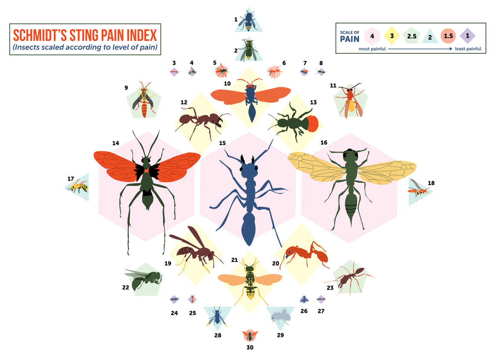

> EXAM || PG5100 - Enterprise 1 || ID 116
# Schmidts Stinging Friends

Welcome to 'Schmidts Stinging Friends', a Gacha-game based on *The Schmidt Pain Index*.

In this game you will collect cards of with varying Pain Levels, ranging from the nettleish 10 to the torturous 40. The cards come in Card Packs that you can purchase with in-game currency.

New users start out with a cash balance of $1000 and are also gifted 3 complimentary Card Packs. If you happen to have multiple cards of the same type, you are able to Mill these cards when viewing your collection, and then purchase more Card Packs.

Be aware - there are insects flying and crawling around, so you might get stung!

Happy collecting!

## Project description:
The solution is based on material learned during the course PG5100 - Enterprise 1 (Enterpriseprogrammering 1).

The project is based on SpringBoot 2.1.0, written in Java 11, and the front end rendering is done with JSF and XHTML, and is using Maven as the build tool.
Testing is done with JUnit and Selenium with JaCoCo for reporting.

The project is made in three modules: backend, frontend and report, with a root POM-file for dependency- and plugin-management.

The application is deployed to Heroku using Heroku CLI, and is available (as of this writing) at https://pg5100-exam.herokuapp.com.
Note: the service is shut down after a period of inactivity and might use a few seconds to start back up.

## Running the application:
After cloning the repository, do a 'mvn clean install -DskipTests' from the root-module to build the project.

The service will be available on localhost:8080 when running.
####Running all tests:
>From the root-module, do 'mvn clean verify'. A JaCoCo report is generated under the report-module.
####Local Test Run with H2 database:
>In the frontend-module, under the src/test folder, start no.kristiania.pg5100_exam.LocalApplicationRunner.
####Docker-Compose
>In the frontend-module, do 'docker-compose up' to start a containerized PostgreSQL:10 database and the service. This requires a Docker environment to run.

As for requirements I've completed every requirement - R1 through R5 and I have 94% test coverage. 

### Technologies used:
#### Spring-Boot-Starter
Web, Security, Validation, Test, Validation
#### Database
PostgreSQL, H2, FlyWay
#### Testing
JUnit, Selenium, JaCoCo
#### Deployment
Heroku / Heroku CLI

### Extra features:
* Sorting of copies under 'My Collection' - tested by 'testSortCollection'
* Changing of passwords - tested by 'testChangePassword'
* Deployed to Heroku at https://pg5100-exam.herokuapp.com
* docker-compose support to start the application with a PostgreSQL database

### Other notes
The project is based on the curriculum-repository https://github.com/arcuri82/testing_security_development_enterprise_systems. 
All dependency- and plugin versions are taken from this project.

## External sources:
From https://github.com/arcuri82/testing_security_development_enterprise_systems:
* .gitignore
* POM-files are based on the versioning found here
* SeleniumDriverHandler and SeleniumLocalIT

'Schmidts Pain Scale' data taken from:
https://www.atlasobscura.com/articles/the-colorful-pain-index-of-the-stinging-ants-bees-and-wasps-around-the-world
